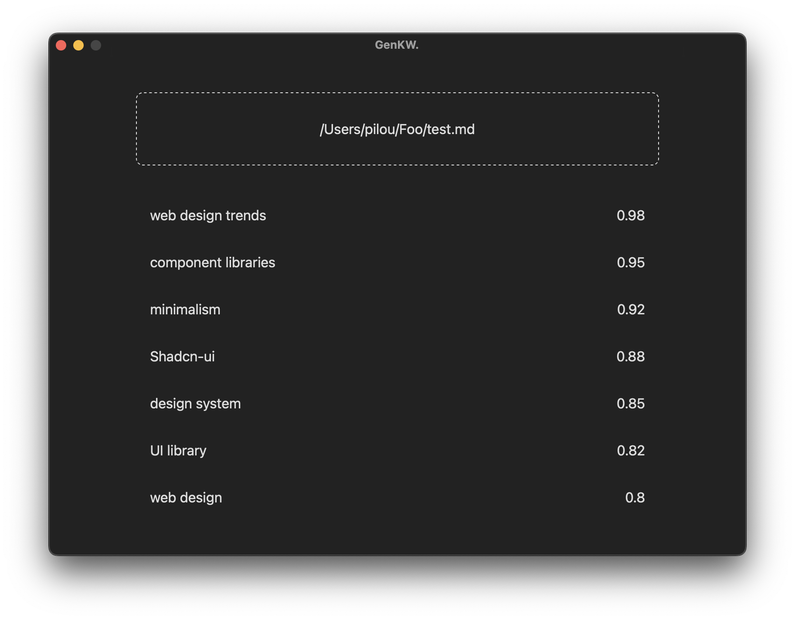

# Templite

A lite template of a MacOS app. Build with Bun (TypeScript) and Tauri (Rust). Native feelin' and fast.



## Prerequisites

https://www.rust-lang.org/

https://ollama.ai/

https://bun.sh/

## Usage

Clone the repo :

```bash
git clone git@github.com:PierreLouisLetoquart/templite.git
cd templite
```

Install dependencies :

```bash
bun install
```

Run the app :

```bash
bun run tauri dev
```
